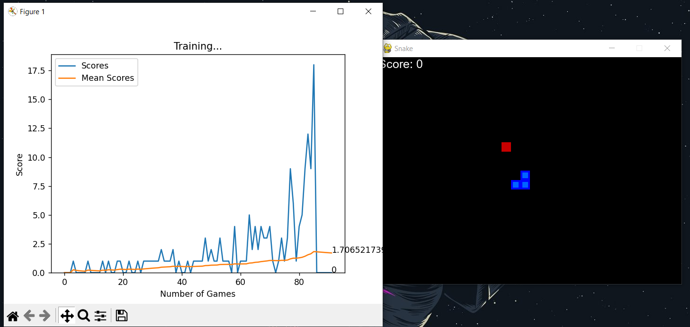

## Snake Game AI

This project implements a Snake game with an AI agent using Pygame and PyTorch. The Snake game is a classic arcade game, and in this version, an AI agent is trained to play the game using Q-learning.

### Files:

1. **game.py**

   - Defines the `SnakeGameAI` class, which represents the Snake game.
   - Handles game mechanics such as initialization, resetting, user input, collision detection, and updating the game state.
   - Utilizes Pygame for graphical display and user input.

2. **agent.py**

   - Implements the `Agent` class, which represents the Q-learning agent controlling the Snake in the game.
   - Manages the agent's memory, training, and decision-making process.
   - Utilizes a neural network model (`LinearQNet`) and a Q-trainer (`QTrainer`) for training.

3. **helper.py**

   - Provides a helper function (`plot`) for real-time plotting of the game scores and mean scores.
   - Uses Matplotlib for plotting and IPython for interactive display.

4. **model.py**

   - Defines the neural network model (`LinearQNet`) used by the Q-learning agent.
   - Implements the Q-trainer (`QTrainer`) for training the model with Q-learning.

### How to Run:

1. Ensure you have Python installed on your system.
2. Install the required libraries by running:
   ```bash
   pip install pygame torch numpy
   ```
3. Run the `train()` function in the `agent.py` file to start training the Snake game AI.

### Controls:

- Use the arrow keys to control the Snake during training.
- Press 'q' to quit the game.

### Notes:

- The game uses Pygame for graphical display, and the training progress is visualized in real-time.
- The Q-learning agent learns to play the Snake game by exploring and exploiting different actions based on the game state.

Feel free to experiment with the parameters, such as `MAX_MEMORY`, `BATCH_SIZE`, and learning rate (`LR`), to observe their impact on the training process.

# Game:

